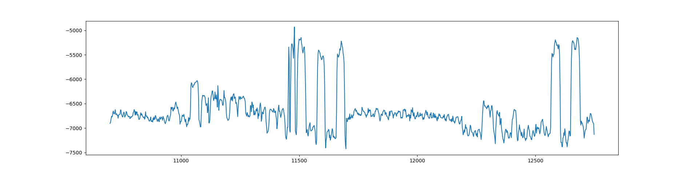
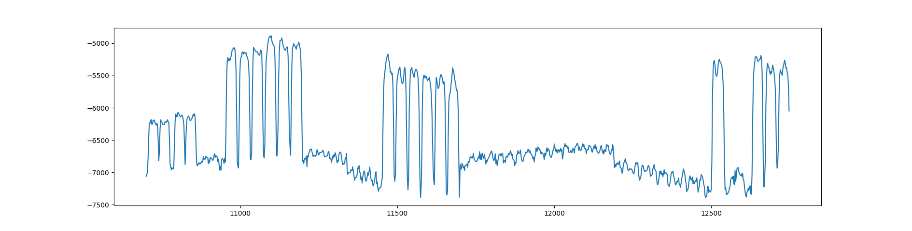
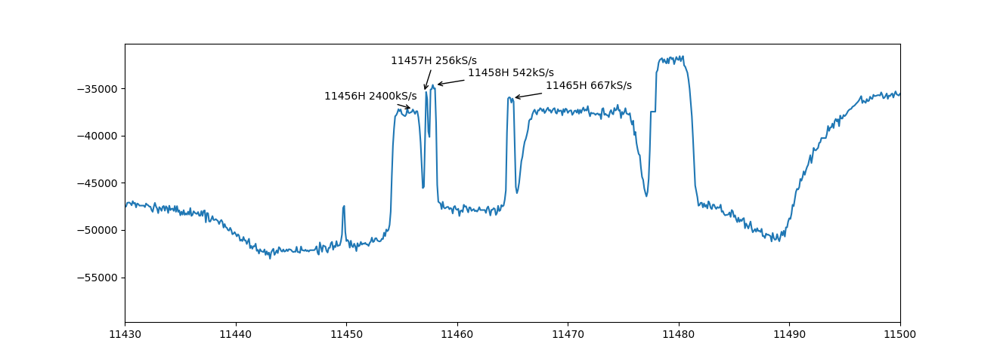
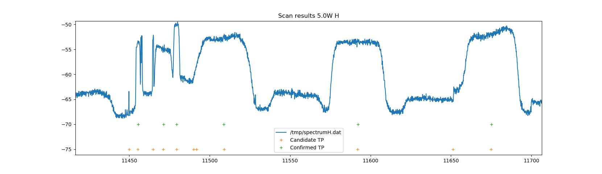

# Neumo-blindscan

User space code for DVB blind-scanning, getting spectra and getting IQ constellation samples
on tbs based DVB cards. Currently supports:

* stid135-based cards: tbs6909x, tbs6903x, tbs6916
* stv091x based cards: tbs5927
* si2183 based cards: tbs6504
* tas2101 based cards (incomplete): tbs5990, tbs6904
* m88rs6060 based cards: tbs6904se

The code requires a patched kernel tree which is available
at https://github.com/deeptho/linux_media
Always use the latest versions from both repositories, or make sure that the versions match
(e.g. the same tag or the same branch). Installation instructions for installing the drivers in Ubuntu can be found in [INSTALL.md](INSTALL.md)

Specifically some features require that the kernel modules support at least neumodvb api 1.6


## Tuning and streaming multiple streams of a multistream mux

The following works only on stid135.

First tune to a mux, using adapter 8 and the LNB the cable connected to RF input 1. The LNB is connected to a switch
on uncommitted port 3. The mux we tune is 12606V on 5.0W. It uses physical layer srambling with code ROOT+16416.
We ask the frontend to output bbframes instead of a stransport stream:

`neumo-tune -ctune -A blind -a 8 -r 1 -U3 -f 12606000 -pV --pls-code=ROOT+16416  --stream-id=4 -b`

Now extract the two streams by connecting to frontend 0 on demux 8. We specify 0x2000 as the pid,
which means the whole transport stream. the two streams have ISI 3 and 5:
`neumo-dmx -a 8 -d 0 --pid 0x2000 -b   --bbframes-isi=4 > /tmp/stream4.ts &`

`neumo-dmx -a 8 -d 0 --pid 0x2000 -b   --bbframes-isi=5 > /tmp/stream5.ts &`

After a while stop the three commands (neumo-tune and neumo-dmx).
Stream 4 is a regular transport stream as can be seen by inspecting it with
`tsanalyze /tmp/stream4.ts'.

Stream 5 is a transport stream containineg one T2mi stream with pid 0x1000. Extract it as follows:

`tsp -P t2mi --pid=0x1000  < /tmp/stream5.ts > /tmp/stream5b.ts`
Then it can be analyzed as follows:
`tsanalyze /tmp/stream5b.ts'.

## Tuning and streaming a T2MI stream

First tune to a mux 12606V on adapter 8, and optionally specify the default stream_id 4
`neumo-tune -ctune -A blind -a 8 -r 1 -U3 -f 12606000 -pV --pls-code=ROOT+16416  --stream-id=4 -b`

Then ask the demux to select stream 5 embedded in pid 270 from adapter 8. Also ask it to then
internally demux the T2MI stream embedded in pid 4096 to a transport stream. Then ask that this transport
stream is extracted full by specifying the fake pid 0x2000 that means ``full transport stream''

`neumo-dmx -a 8 -d 0 --stid-isi=5 --stid-pid=270 --t2mi-pid=4096 --t2mi-plp=0 --pid 0x2000  > /tmp/stream5.ts`


## Spectrum Acquisition

There are two methods of spectrum acquisition: `sweep` and `fft`. `sweep` sweeps across the frequency spectrum and measures
narrow band power, taking into account AGC settings. `fft` uses the builtin fft engine on the stid135 chip to scan
the spectrum in very high resolution (100kHz per default, but 50kHz sometimes detects more narrow band transponders).

The spectrum will be saved to `/tmp/spectrum_rf2_H.dat` and `/tmp/spectrum_rf2_V.dat`, or similarly named files.

### Sweep method
`neumo-blindscan  -c spectrum -U8 -a0  --rf-in=2 --spectrum-method sweep --spectral-resolution 2000`
will perform a sweep scan with 2MHz resolution. On stid135 this is actually slower than fft scan.
It will get a full spectrum in less 30 seconds with a resolution of 2MHz on tbs5927.

### FFT method
`neumo-blindscan  -c spectrum -U8 -a0  --rf-in=2 --spectrum-method fft --spectral-resolution 100` will scan a satellite
in less 30 seconds with a resolution of 100kHz on tbs6909x and tbs6903x. This is using the internal high speed fft engine.

Here are some example spectra for 5.0West; horizontal and vertical.






Here is a portion of a 100kHz spectrum captured on 5.0West, horizontal polarization created on tbs6909x
It shows several narrow band transponders




## Blindscan
The blind scan code scans all or some of the frequency spectrum
available on a DVB-S2 tuner. The scanned portion is the range
[start-freq, end-freq]. Unless `-p` is specified, both polarizations
will be scanned. There are two ways of scanning: `exhaustive` and `spectral-peaks`.

This blind scanner can also scan transponders which have "Physical Layer Scrambling" turned
on. When it discovers such a transponder it uses its built-in codes (for the multistreams on
5.0West). Additional mod_modes/mod_codes can be added using --pls-modes. For example `--pls-modes ROOT+12 GOLD+13`
adds two codes to try.

It is also possible to specify a range of ROOT+x codes to test. This option is very slow but
will take around 90 minutes at most. Currently  this is not working on stid135.

### Exhaustive scan
The spectrum is scanned in steps of step-freq. The default
value is fine for scanning high symbolrate transponders.
To scan low symbol rate transponders, set max-symbol-rate to a low value
and star-freq close to where they might be.

### Spectral peaks scan

`neumo-blindscan  -c blindscan -U8 -a0  --rf-in=2 -pV --spectral-resolution 100` will connect adapter 0
to RF input 2 and scan the full vertical band.

First the spectrum is analyzed to find candidate transponders and then a blindscan is performed
on those transponders. If the transponder locks, the output is saved.
Then the actual blindscan starts and results are printed on the terminal and saved
in `/tmp/blindscan_rf2_V.dat`. Here is a sample output:

```
SEARCH: 10700.000-11700.000 pol=V
select rf_in=2
	FE_GET_EVENT: stat=543, signal=1 carrier=1 viterbi=1 sync=1 timedout=0 locked=1
RESULT: freq=10719.631V Symrate=27499 Stream=-1    pls_mode= 3:262143 MATYPE: 0xf2
SIG=-26.48dB SIG= 74% CNR=13.50dB CNR= 67% SYS(22) MOD(6) FEC_AUTO INV_OFF PILAUTO ROLL_20
retuning
	FE_GET_EVENT: stat=543, signal=1 carrier=1 viterbi=1 sync=1 timedout=0 locked=1
RESULT: freq=10757.991V Symrate=27498 Stream=-1    pls_mode= 3:262143 MATYPE: 0xf2
SIG=-26.60dB SIG= 74% CNR=13.70dB CNR= 68% SYS(22) MOD(6) FEC_AUTO INV_OFF PILAUTO ROLL_20
```

On stv091x, the code searches for falling or rising edges of transponders. This is less reliable
than the stid135 algorithm (see below). After a blindscan succeeds, the spectrum part for that transponder
is skipped to avoid double detections and to save time. The main search parameters are

* max-symbol-rate: determines how far to scan from an edge in the spectrum. Set higher for high symbol rates. High values
are usually recommended.


On stid135, the code searches for central frequencies of transponders after acquiring the complete spectrum.
The spectrum is of high resolution and the peak detector is more sophisticated. As a result most spectral peaks are
found, even very weak or very narrow band ones. The code scans all candidate peaks and skips the spectrum part
for any found transponder. The main search parameters are:

* search-range: determines how far to search from the center of frequency peaks. A typical vale is 10000
* spectral-resolution: determines how finely to scan the spectrum. Use 50 for very low symbolrates. Otherwise use 100.

The stid135 algorithm's peak finding is more reliable. On the other hand, the actual blindscan is slower for
and less reliable for low symbol rates compared to stv091x. Also scanning false peaks is especially slow and
this makes scanning slower than it could be.
With the current code, scanning a full satellite (H and V; 10700Ghz-12750Ghz) takes a few minutes.

The most influential parameters are `spectral-resolution` (100kHz is fine, 50kHz is sometimes better), and
`search-range` (default: 10Mhz, higher is sometimes better).  `spectral-resolution` determines the accuracy
of the spectrum. Candidate peaks may be lost if the value is too high. `search-range` determines how far from the
candidate peak the blindscan can search for a lock. To find high symbolrate transponders (30Ms/s and more), a
larger value will find more transponders if the peak-finder does not find the center of the transponder, but
rather a value closer to its edges.

Below is an older example for scanning 5.0W with default parameters.



The green pluses indicate the found transponders. The orange ones are the candidate peaks. Several
narrow band transponders are found properly (11456H, 2400 kS/s and 11480H, 3124kS/s), but three transponders with very low symbolrate are missed (11458H, 542 kS/s and 11465H, 668kS). 11465H, 668kS can be found sometimes with a spectral
resolution setting o5 50kHz and can be tuned to reliably. The other one does not tune, even on stv091x on Linux,
even though it can be done on Windows. So the drivers need some more improvement.


### Parallel blindscan

On tbs6909x, blindscan can use all tuners

`stid135-blindscan  -cblindscan -a 0 1 2 3 4 5 6 7 -U8   --rf-in=2 -pV` will connect all adapters
to RF input 2 and scan the full vertical band


## Obtaining constellation samples

`neumo-tune -a 0 -U 8 -c iq -f 10719000 -pV  -n 8000` will connect to adapter 8, tune to 11138V  and obtain
8000 IQ samples. The samples will be saved in `/tmp/iq_a0_10719.000V.dat`
Currently this requires an active DVB signal. This will not work for inactive transponders or continuous stream transponders. The script plotiq.py can be used to view the samples. Ypu will need to install pandas, e.g.,

```
pip3 install pandas
```


## Blindscan tuning a single transponder

`neumo-tune -a 0  -Ablind --rf-in=2 -U 8 -c tune -f 10719000 -pV` will connect adapter 0 to
RF INPUT 2 on the card, send uncommitted switch command 8, tune to 10719V with the specified parameters  and then wait forever.

The output will look like this:

```
adapter=0
rf_in=2
frontend=0
freq=10719000
pol=2
pls_codes[5]={ 4202496, 2048, 98139136, 134216704, 80015360, }
diseqc=UC: U=8 C=-1
Blindscan drivers found
Name of card: TurboSight TBS 6909x
Name of adapter: A0 TBS 6909X
Name of frontend: TurboSight TBS 6909x
Tuning
==========================
Tuning to DVBS1/2 10719.000V
select rf_in=2
BLIND TUNE search-range=10000
	FE_GET_EVENT: stat=543, timedout=0 locked=1
	FE_READ_STATUS: stat=543, signal=1 carrier=1 viterbi=1 sync=1 timedout=0 locked=1
```


## Non-Blindscan tuning a single transponder

`./neumo-tune -a 0 --rf-in=2 -U 8 -c tune -f 10719000 -pV -S 27500 --delsys DVBS2 --modulation PSK_8` will connect adapter 0 to
RF INPUT 2 on the card, send uncommitted switch command 8, tune to 10719V with the specified parameters  and then wait forever.

The output will look like this:

```
adapter=0
rf_in=2
frontend=0
freq=10719000
pol=2
pls_codes[5]={ 4202496, 2048, 98139136, 134216704, 80015360, }
diseqc=UC: U=8 C=-1
Blindscan drivers found
Name of card: TurboSight TBS 6909x
Name of adapter: A0 TBS 6909X
Name of frontend: TurboSight TBS 6909x
Tuning
==========================
Tuning to DVBS1/2 10719.000V
select rf_in=2
BLIND TUNE search-range=10000
	FE_GET_EVENT: stat=543, timedout=0 locked=1
	FE_READ_STATUS: stat=543, signal=1 carrier=1 viterbi=1 sync=1 timedout=0 locked=1
```

## Usage neumo-blindscan

```
Usage: neumo-blindscan [OPTIONS] [L]

Positionals:
  L ENUM:value in {C->4,universal->1,wideband->2,wideband-uk->3} OR {4,1,2,3}=1
                              LNB Type

Options:
  -h,--help                   Print this help message and exit
  -c,--command ENUM:value in {blindscan->0,iq->2,spectrum->1} OR {0,2,1}=1
                              Command to execute
  --blindscan-method ENUM:value in {fft->2,sweep->1} OR {2,1}=2
                              Blindscan method
  --delsys ENUM:value in {ATSC->11,ATSCMH->12,AUTO->22,CMMB->14,DAB->15,DCII->21,DSS->4,DTMB->13,DVBC->1,DVBC2->19,DVBH->7,DVBS->5,DVBS2->6,DVBS2X->20,DVBT->3,DVBT2->16,ISDBC->10,ISDBS->9,ISDBT->8,TURBO->17} OR {11,12,22,14,15,21,4,13,1,19,7,5,6,20,3,16,10,9,8,17}=6
                              Delivery system
  --lnb-type ENUM:value in {C->4,universal->1,wideband->2,wideband-uk->3} OR {4,1,2,3}=1
                              LNB Type
  --spectrum-method ENUM:value in {fft->1,sweep->0} OR {1,0}=0
                              Spectrum method
  -a,--adapter INT=0          Adapter number
  -r,--rf-in INT=-1           RF input
  --frontend INT=0            Frontend number
  -s,--start-freq INT=-1      Start of frequency range to scan (kHz)
  -e,--end-freq INT=-1        End of frequency range to scan (kHz)
  -S,--step-freq INT=6000     Frequency step (kHz)
  -R,--spectral-resolution INT=2000
                              Spectral resolution (kHz)
  -F,--fft-size INT=256       FFT size
  -M,--max-symbol-rate INT=45000
                              Maximal symbolrate (kHz)
  --search-range INT=10000    Search range (kHz)
  -p,--pol INT:value in {BOTH->3,H->1,V->2} OR {3,1,2}=3
                              Polarization to scan
  --pls-modes TEXT=[] ...     PLS modes (ROOT, GOLD, COMBO) and code to scan, separated by +
  --start-pls-code INT=-1     Start of PLS code range to start (mode=ROOT!)
  --end-pls-code INT=-1       End of PLS code range to start (mode=ROOT!)
  -d,--diseqc TEXT=UC         DiSEqC command string (C: send committed command; U: send uncommitted command
  -U,--uncommitted INT=-1     Uncommitted switch number (lowest is 0)
  -C,--committed INT=-1       Committed switch number (lowest is 0)

```

DiSEqC switching signals are sent based on the DiSEqC command string. This
string controls the order in which DiSEqC commands are sent, e.g., "UC" means
send uncommitted command first, then committed command. "UCU" means that the uncommitted
command will be sent twice. The switch ports are specified by the --uncommitted
and --committed arguments


## Usage neumo-dmx
Stream dvb data from a demux to standard output
Usage: DVB demux program [OPTIONS]

Options:
  -h,--help                   Print this help message and exit
  -a,--adapter INT=0          Adapter number
  -d,--demux INT=0            Demux number
  -p,--pid INT=8192           pid (omit for full transport stream)
  -b,--bbframes               Unpack a single embedded bbframes stream
  --bbframes-pid INT=270      pid in which bbframes are embedded
  --bbframes-isi INT=4        isi


## Usage neumo-tune

```
Usage: ./neumo-tune [OPTIONS]

Options:
  -h,--help                   Print this help message and exit
  -c,--command ENUM:value in {iq->1,tune->0} OR {1,0}=0
                              Command to execute
  -A,--algo ENUM:value in {blind->0,cold->2,warm->1} OR {0,2,1}=0
                              Algorithm for tuning
  -a,--adapter INT=0          Adapter number
  -r,--rf-in INT=-1           RF input
  --frontend INT=0            Frontend number
  -S,--symbol-rate INT=-1     Symbolrate (kHz)
  -m,--modulation ENUM:value in {APSK_1024->30,APSK_128->22,APSK_128L->28,APSK_16->10,APSK_16L->25,APSK_256->23,APSK_256L->29,APSK_32->11,APSK_32L->26,APSK_64->21,APSK_64L->27,APSK_8L->24,C_OQPSK->17,C_QPSK->14,DQPSK->12,I_QPSK->15,PSK_8->9,QAM_1024->19,QAM_128->4,QAM_16->1,QAM_256->5,QAM_32->2,QAM_4096->20,QAM_4_NR->13,QAM_512->18,QAM_64->3,QAM_AUTO->6,QPSK->0,Q_QPSK->16,VSB_16->8,VSB_8->7} OR {30,22,28,10,25,23,29,11,26,21,27,24,17,14,12,15,9,19,4,1,5,2,20,13,18,3,6,0,16,8,7}=9
                              modulation
  --delsys ENUM:value in {ATSC->11,ATSCMH->12,AUTO->22,CMMB->14,DAB->15,DCII->21,DSS->4,DTMB->13,DVBC->1,DVBC2->19,DVBH->7,DVBS->5,DVBS2->6,DVBS2X->20,DVBT->3,DVBT2->16,ISDBC->10,ISDBS->9,ISDBT->8,TURBO->17} OR {11,12,22,14,15,21,4,13,1,19,7,5,6,20,3,16,10,9,8,17}=6
                              Delivery system
  -R,--search-range INT=10000 Search range (kHz)
  -p,--pol INT:value in {H->1,V->2} OR {1,2}=0
                              Polarization to scan
  -n,--num-samples INT=1024   Number of IQ samples to fetch
  -f,--frequency INT=-1       Frequency to tune for getting IQ samples
  -s,--stream-id INT=-1       stream_id to select
  --pls-code TEXT=[] ...      PLS mode (ROOT, GOLD, COMBO) and code (number) to scan, separated by +
  --start-pls-code INT=-1     Start of PLS code range to start (mode=ROOT!)
  --end-pls-code INT=-1       End of PLS code range to start (mode=ROOT!)
  -T,--pls-search-timeout INT=25
                              Search range timeout
  -d,--diseqc TEXT=UC         DiSEqC command string (C: send committed command; U: send uncommitted command
  -b,--bb_frames              Ask to outputput bbframes encapsulated in mpeg packets
  -U,--uncommitted INT=-1     Uncommitted switch number (lowest is 0)
  -C,--committed INT=-1       Committed switch number (lowest is 0)

```

## Usage stid135-blindscan

```
Usage: stid135-blindscan [OPTIONS]


Positionals:
  L ENUM:value in {C->4,universal->1,wideband->2,wideband-uk->3} OR {4,1,2,3}=1
                              LNB Type

Options:
  -h,--help                   Print this help message and exit
  -c,--command ENUM:value in {blindscan->0,iq->2,spectrum->1} OR {0,2,1}=1
                              Command to execute
  --blindscan-method ENUM:value in {fft->2,sweep->1} OR {2,1}=2
                              Blindscan method
  --delsys ENUM:value in {ATSC->11,ATSCMH->12,AUTO->22,CMMB->14,DAB->15,DCII->21,DSS->4,DTMB->13,DVBC->1,DVBC2->19,DVBH->7,DVBS->5,DVBS2->6,DVBS2X->20,DVBT->3,DVBT2->16,ISDBC->10,ISDBS->9,ISDBT->8,TURBO->17} OR {11,12,22,14,15,21,4,13,1,19,7,5,6,20,3,16,10,9,8,17}=6
                              Delivery system
  --lnb-type ENUM:value in {C->4,universal->1,wideband->2,wideband-uk->3} OR {4,1,2,3}=1
                              LNB Type
  --spectrum-method ENUM:value in {fft->1,sweep->0} OR {1,0}=1
                              Spectrum method
  -a,--adapter INT=[] ...     Adapter number
  -r,--rf-in INT=-1           RF input
  --frontend INT=0            Frontend number
  -s,--start-freq INT=-1      Start of frequency range to scan (kHz)
  -e,--end-freq INT=-1        End of frequency range to scan (kHz)
  -S,--step-freq INT=6000     Frequency step (kHz)
  --spectral-resolution INT=0 Spectral resolution (kHz)
  -F,--fft-size INT=512       FFT size
  -R,--search-range INT=10000 Search range (kHz)
  -p,--pol INT:value in {BOTH->3,H->1,V->2} OR {3,1,2}=3
                              Polarisation to scan
  --pls-modes TEXT=[] ...     PLS modes (ROOT, GOLD, COMBO) and code to scan, separated by +
  --start-pls-code INT=-1     Start of PLS code range to start (mode=ROOT!)
  --end-pls-code INT=-1       End of PLS code range to start (mode=ROOT!)
  -d,--diseqc TEXT=UC         DiSEqC command string (C: send committed command; U: send uncommitted command
  -U,--uncommitted INT=-1     Uncommitted switch number (lowest is 0)
  -C,--committed INT=-1       Committed switch number (lowest is 0)

```

## Compiling
The code is compiled with clang++. Make sure it is installed as some versions of g++ have some
problems compiling this

```
cd <whereever you have checkout>
mkdir build
cd build
cmake ..
make
```

The executable will be located in `build/src/blindscan` and can be copied to `/usr/bin/`
